# 🌾 Sistem Monitoring IoT Perkebunan Tebu

## Daftar Isi
- [Overview Sistem](#overview-sistem)
- [Arsitektur Sistem](#arsitektur-sistem)
- [Flow Data dan Proses](#flow-data-dan-proses)
- [Komponen Utama](#komponen-utama)
- [Entity Relationship Diagram (ERD)](#entity-relationship-diagram-erd)
- [MQTT Topics dan Payload](#mqtt-topics-dan-payload)
- [REST API Endpoints](#rest-api-endpoints)
- [Sistem Alert dan Monitoring](#sistem-alert-dan-monitoring)
- [Kasus Penggunaan](#kasus-penggunaan)
- [Deployment dan Setup](#deployment-dan-setup)

---

## Overview Sistem

Sistem monitoring IoT untuk perkebunan tebu yang memungkinkan pemantauan real-time kondisi lahan dan tanaman melalui sensor-sensor yang terpasang di berbagai lokasi perkebunan. Sistem ini menggunakan protokol MQTT untuk komunikasi data dan menyediakan REST API untuk dashboard monitoring.

### Tujuan Utama:
- 🌡️ **Monitoring Real-time**: Pemantauan suhu, kelembaban, pH tanah, dan tingkat cahaya
- 📱 **Dashboard Web**: Interface untuk melihat data sensor dan status perangkat
- 🚨 **Sistem Alert**: Notifikasi otomatis jika parameter di luar batas normal
- 📊 **Analytics**: Analisis data historis dan tren kondisi perkebunan
- 🎛️ **Remote Control**: Kontrol perangkat IoT dari jarak jauh

---

## Arsitektur Sistem

```
┌─────────────────┐    MQTT     ┌─────────────────┐    HTTP/REST    ┌─────────────────┐
│   ESP32 Sensors │ ──────────► │   Go Backend    │ ◄──────────────► │  Web Dashboard  │
│                 │             │   (Gin + MQTT)  │                 │   (Frontend)    │
└─────────────────┘             └─────────────────┘                 └─────────────────┘
                                         │
                                         ▼
                                ┌─────────────────┐
                                │   PostgreSQL    │
                                │    Database     │
                                └─────────────────┘
```

### Komponen Teknologi:
- **Backend**: Go (Gin Framework, Gorm ORM)
- **Database**: PostgreSQL
- **MQTT Broker**: Eclipse Mosquitto
- **Message Protocol**: MQTT v3.1.1
- **API Documentation**: Swagger/OpenAPI
- **Containerization**: Docker & Docker Compose

---

## Flow Data dan Proses

### 1. Data Collection Flow


### 2. Command Flow


### 3. Alert Flow

```mermaid
graph TD
    A[New Sensor Data] --> B[Check Thresholds]
    B --> C{Temperature > 35°C?}
    C -->|Yes| D[Create Temperature Alert]
    B --> E{Humidity < 40%?}
    E -->|Yes| F[Create Humidity Alert]
    B --> G{Soil pH < 5.5 or > 7.5?}
    G -->|Yes| H[Create pH Alert]
    B --> I{Light < 200 lux?}
    I -->|Yes| J[Create Light Alert]
    D --> K[Save to sensor_alerts]
    F --> K
    H --> K
    J --> K
    K --> L[Send Notification]
```


---

## Komponen Utama

### 1. MQTT Service (`mqtt_service.go`)
```go
// Mengelola koneksi MQTT dan subscription ke topics
type MQTTService struct {
    client mqtt.Client
    db     *gorm.DB
}

// Topics yang digunakan:
// - sensor/+/data     : Data dari semua sensor
// - device/+/status   : Status perangkat
// - device/+/command  : Perintah ke perangkat
```

### 2. Sensor Controller (`sensor_controller.go`)
```go
// REST API endpoints untuk:
// - GET /sensors/data         : List data sensor
// - POST /sensors/data        : Insert data manual
// - GET /sensors/stats        : Statistik sensor
// - GET /devices/status       : Status perangkat
// - POST /devices/command     : Kirim perintah
// - GET /alerts              : List alert
```

### 3. Alert Service (`sensor_alert_service.go`)
```go
// Logika untuk mendeteksi kondisi abnormal:
// - Suhu > 35°C atau < 10°C
// - Kelembaban < 40% atau > 90%
// - pH tanah < 5.5 atau > 7.5
// - Cahaya < 200 lux
```

---

## Entity Relationship Diagram (ERD)

```
┌─────────────────────┐       ┌─────────────────────┐       ┌─────────────────────┐
│    sensor_data      │       │   device_status     │       │   sensor_alerts     │
├─────────────────────┤       ├─────────────────────┤       ├─────────────────────┤
│ id (PK)            │       │ id (PK)            │       │ id (PK)            │
│ device_id          │       │ device_id          │       │ device_id          │
│ farm_name          │       │ farm_name          │       │ farm_name          │
│ location           │       │ location           │       │ sensor_type        │
│ temperature        │       │ is_online          │       │ alert_type         │
│ humidity           │       │ battery_level      │       │ current_value      │
│ soil_ph            │       │ signal_strength    │       │ threshold_value    │
│ light_intensity    │       │ last_seen          │       │ severity           │
│ timestamp          │       │ firmware_version   │       │ message            │
│ created_at         │       │ created_at         │       │ is_resolved        │
│ updated_at         │       │ updated_at         │       │ resolved_at        │
└─────────────────────┘       └─────────────────────┘       │ created_at         │
                                                            │ updated_at         │
                                                            └─────────────────────┘
```

**Relasi:**
- `sensor_data.device_id` → `device_status.device_id` (1:N)
- `sensor_alerts.device_id` → `device_status.device_id` (1:N)

---

## MQTT Topics dan Payload

### 1. Sensor Data Topic: `sensor/{device_id}/data`
```json
{
  "device_id": "ESP32_001",
  "farm_name": "Kebun Tebu Manis",
  "location": "Blok A1",
  "temperature": 28.5,
  "humidity": 65.2,
  "soil_ph": 6.8,
  "light_intensity": 850,
  "timestamp": "2025-06-27T10:30:00Z"
}
```

### 2. Device Status Topic: `device/{device_id}/status`
```json
{
  "device_id": "ESP32_001",
  "farm_name": "Kebun Tebu Manis",
  "location": "Blok A1",
  "is_online": true,
  "battery_level": 85,
  "signal_strength": -45,
  "firmware_version": "v1.2.3"
}
```

### 3. Command Topic: `device/{device_id}/command`
```json
{
  "command": "restart",
  "parameters": {
    "delay": 5000
  },
  "timestamp": "2025-06-27T10:30:00Z"
}
```

**Available Commands:**
- `restart`: Restart perangkat
- `calibrate`: Kalibrasi sensor
- `sleep`: Mode sleep untuk hemat baterai
- `wake`: Bangunkan dari mode sleep
- `update_interval`: Ubah interval pengiriman data

---

## REST API Endpoints

### Sensor Data Endpoints
```http
GET    /api/v1/sensors/data              # List semua data sensor
POST   /api/v1/sensors/data              # Input data sensor manual
GET    /api/v1/sensors/data/{id}         # Detail data sensor
GET    /api/v1/sensors/stats             # Statistik sensor
```

### Device Management Endpoints
```http
GET    /api/v1/devices/status            # Status semua perangkat
GET    /api/v1/devices/status/{id}       # Status perangkat spesifik
POST   /api/v1/devices/command           # Kirim perintah ke perangkat
```

### Alert Management Endpoints
```http
GET    /api/v1/alerts                    # List semua alert
GET    /api/v1/alerts/{id}               # Detail alert
PUT    /api/v1/alerts/{id}/resolve       # Tandai alert sebagai resolved
```

### Example API Response:
```json
{
  "status": "success",
  "message": "Data retrieved successfully",
  "data": [
    {
      "id": 1,
      "device_id": "ESP32_001",
      "farm_name": "Kebun Tebu Manis",
      "location": "Blok A1",
      "temperature": 28.5,
      "humidity": 65.2,
      "soil_ph": 6.8,
      "light_intensity": 850,
      "timestamp": "2025-06-27T10:30:00Z"
    }
  ],
  "pagination": {
    "page": 1,
    "limit": 10,
    "total": 150,
    "total_pages": 15
  }
}
```

---

## Sistem Alert dan Monitoring

### Threshold Configuration
```go
var AlertThresholds = map[string]map[string]float64{
    "temperature": {
        "min": 10.0,
        "max": 35.0,
    },
    "humidity": {
        "min": 40.0,
        "max": 90.0,
    },
    "soil_ph": {
        "min": 5.5,
        "max": 7.5,
    },
    "light_intensity": {
        "min": 200.0,
        "max": 100000.0,
    },
}
```

### Alert Severity Levels
- **🔴 CRITICAL**: Nilai sangat di luar batas normal (pH < 5.0 atau > 8.0)
- **🟡 WARNING**: Nilai mendekati batas (Temperature 33-35°C)
- **🔵 INFO**: Informasi umum (Device offline, battery low)

### Alert Actions
1. **Database Logging**: Semua alert disimpan ke tabel `sensor_alerts`
2. **Real-time Notification**: WebSocket untuk update real-time
3. **Email/SMS**: Notifikasi untuk alert critical (konfigurasi optional)
4. **Auto-resolution**: Alert otomatis resolved jika nilai kembali normal

---

## Kasus Penggunaan

### 1. Monitoring Harian Perkebunan
**Aktor**: Manager Perkebunan
**Skenario**:
1. Manager membuka dashboard web
2. Melihat data real-time dari semua sensor di perkebunan
3. Menganalisis tren suhu dan kelembaban per blok
4. Mengidentifikasi area yang memerlukan perhatian khusus

### 2. Deteksi Masalah Otomatis
**Aktor**: Sistem
**Skenario**:
1. Sensor ESP32 mendeteksi suhu 37°C (di atas threshold)
2. Data dikirim via MQTT
3. Backend Go menerima dan memproses data
4. Sistem generate alert "High Temperature"
5. Notifikasi dikirim ke manager
6. Manager dapat segera mengambil tindakan

### 3. Kontrol Remote Perangkat
**Aktor**: Teknisi
**Skenario**:
1. Teknisi melihat perangkat ESP32_005 offline
2. Mengirim command "restart" via dashboard
3. Backend publish command ke MQTT topic
4. ESP32 menerima command dan restart
5. Status perangkat kembali online
6. Teknisi memverifikasi perangkat normal

### 4. Analisis Data Historis
**Aktor**: Agronomist
**Skenario**:
1. Agronomist mengakses API statistik
2. Menganalisis data pH tanah 30 hari terakhir
3. Menemukan tren penurunan pH di Blok C
4. Merekomendasikan aplikasi kapur untuk perbaikan pH
5. Monitoring efektivitas treatment

---

## Deployment dan Setup

### 1. Local Development
```bash
# Clone project
git clone <repository>
cd tets-mqtt

# Setup environment
cp .env.example .env
# Edit .env dengan konfigurasi local

# Start dengan Docker Compose
docker-compose up -d

# Atau manual:
# 1. Start PostgreSQL
# 2. Start MQTT Broker (Mosquitto)
# 3. Run migrations
go run cmd/migrate.go

# 4. Start application
go run main.go
```

### 2. Production Deployment
```bash
# Build aplikasi
go build -o bin/main main.go

# Deploy dengan Docker
docker-compose -f docker-compose.prod.yml up -d

# Setup reverse proxy (Nginx)
# Setup SSL certificate (Let's Encrypt)
# Configure monitoring (Prometheus/Grafana)
```

### 3. Environment Variables
```env
# Database
DB_HOST=localhost
DB_PORT=5432
DB_USER=postgres
DB_PASSWORD=password
DB_NAME=sugar_cane_iot

# MQTT
MQTT_BROKER=localhost:1883
MQTT_USERNAME=
MQTT_PASSWORD=
MQTT_CLIENT_ID=go_backend

# API
API_PORT=8080
API_HOST=localhost
JWT_SECRET=your_jwt_secret

# Alerts
ENABLE_EMAIL_ALERTS=false
EMAIL_SMTP_HOST=
EMAIL_SMTP_PORT=587
EMAIL_USERNAME=
EMAIL_PASSWORD=
```

---

## Monitoring dan Maintenance

### 1. Health Checks
- **Database**: Connection pool status
- **MQTT**: Broker connectivity
- **Memory**: Application memory usage
- **API**: Response time monitoring

### 2. Logging
- **Error Logs**: Application errors dan exceptions
- **Access Logs**: API request/response
- **MQTT Logs**: Message publish/subscribe
- **Alert Logs**: Alert generation dan resolution

### 3. Backup Strategy
- **Database**: Daily automated backup
- **Configuration**: Version control untuk .env
- **Logs**: Rotasi dan archival

---

## Kesimpulan

Sistem monitoring IoT untuk perkebunan tebu ini menyediakan solusi komprehensif untuk:
- ✅ Monitoring real-time kondisi perkebunan
- ✅ Deteksi dini masalah melalui sistem alert
- ✅ Kontrol remote perangkat IoT
- ✅ Analisis data historis untuk optimasi
- ✅ Dashboard yang user-friendly
- ✅ API yang scalable dan maintainable

Dengan arsitektur modular dan dokumentasi yang lengkap, sistem ini siap untuk production dan dapat dikembangkan lebih lanjut sesuai kebutuhan.

---

**Dibuat oleh**: Tim Development IoT  
**Tanggal**: 27 Juni 2025  
**Versi**: 1.0.0
