# 🌾 Sugar Cane IoT Monitoring System - Technical Documentation

## 📋 Daftar Isi
1. [Gambaran Umum Sistem](#gambaran-umum-sistem)
2. [Arsitektur Sistem](#arsitektur-sistem)
3. [Flowchart Proses](#flowchart-proses)
4. [Database Schema](#database-schema)
5. [API Endpoints](#api-endpoints)
6. [MQTT Topics](#mqtt-topics)
7. [Alert System](#alert-system)
8. [Deployment Diagram](#deployment-diagram)
9. [Sequence Diagram](#sequence-diagram)
10. [Use Cases](#use-cases)

---

## 🎯 Gambaran Umum Sistem

### Tujuan Proyek:
Membangun sistem monitoring IoT untuk perkebunan tebu yang dapat:
- Memantau kondisi NPK tanah secara real-time
- Memberikan alert otomatis jika ada masalah
- Menyediakan dashboard untuk manajemen perkebunan
- Mengoptimalkan penggunaan pupuk dan perawatan tanaman

### Target Pengguna:
- **Petani/Pemilik Kebun** - Monitoring harian
- **Supervisor Lapangan** - Manajemen operasional  
- **Manajer Perkebunan** - Analisis dan pelaporan
- **Teknisi** - Maintenance sistem

---

## 🏗️ Arsitektur Sistem


---

## 🔄 Flowchart Proses

### 1. Data Collection Flow


### 2. Server Processing Flow


### 3. Alert Processing Flow


---

## 🗃️ Database Schema

### Entity Relationship Diagram


### Table Relationships

```sql
-- Primary Tables
sensor_data (1) ----< sensor_alerts (M)
device_status (1) ---- sensor_data (1)

-- Indexes for Performance
INDEX sensor_data_device_timestamp (device_id, timestamp)
INDEX sensor_data_farm_timestamp (farm_name, timestamp)
INDEX sensor_alerts_unresolved (is_resolved, created_at)
INDEX device_status_online (is_online, last_seen)
```

---

## 🌐 API Endpoints

### REST API Structure


### Detailed API Specifications

#### 1. Sensor Data Endpoints

```yaml
GET /api/sensor/data:
  description: "Retrieve sensor data with filtering"
  parameters:
    - device_id: string (optional)
    - farm_name: string (optional)  
    - start_date: string (YYYY-MM-DD)
    - end_date: string (YYYY-MM-DD)
    - limit: integer (default: 50)
    - offset: integer (default: 0)
  response:
    status: "success"
    data: Array<SensorData>
    count: integer
    limit: integer
    offset: integer

GET /api/sensor/latest:
  description: "Get latest sensor readings"
  parameters:
    - device_id: string (optional)
  response:
    status: "success"
    data: SensorData | Array<SensorData>

GET /api/sensor/statistics:
  description: "Get aggregated sensor statistics"
  parameters:
    - device_id: string (optional)
    - farm_name: string (optional)
    - start_date: string
    - end_date: string
  response:
    status: "success"
    data:
      avg_nitrogen: float
      avg_phosphorus: float
      avg_potassium: float
      avg_temperature: float
      avg_humidity: float
      avg_ph: float
      min_nitrogen: float
      max_nitrogen: float
      total_readings: integer
```

#### 2. Device Management Endpoints

```yaml
GET /api/sensor/devices/status:
  description: "Get device online/offline status"
  parameters:
    - device_id: string (optional)
  response:
    status: "success"
    data: Array<DeviceStatus>
    count: integer

POST /api/sensor/devices/:device_id/command:
  description: "Send command to specific device"
  parameters:
    - device_id: string (path parameter)
  body:
    command: string (required)
    payload: object (optional)
  response:
    status: "success"
    message: "Command sent successfully"
    device_id: string
    command: string
    payload: object
    sent_at: timestamp
```

#### 3. Alert Management Endpoints

```yaml
GET /api/sensor/alerts:
  description: "Get sensor alerts with filtering"
  parameters:
    - device_id: string (optional)
    - farm_name: string (optional)
    - severity: string (optional)
    - is_resolved: boolean (optional)
    - limit: integer (default: 50)
    - offset: integer (default: 0)
  response:
    status: "success"
    data: Array<SensorAlert>
    count: integer

PUT /api/sensor/alerts/:id/resolve:
  description: "Mark alert as resolved"
  parameters:
    - id: integer (path parameter)
  response:
    status: "success"
    message: "Alert resolved successfully"
    data: SensorAlert
```

---

## 📡 MQTT Topics

### Topic Structure

```
sugar_vestrack/
├── sensor/
│   ├── ESP32_001/
│   │   ├── data          # Sensor readings
│   │   └── status        # Device status
│   ├── ESP32_002/
│   │   ├── data
│   │   └── status
│   └── ESP32_003/
│       ├── data
│       └── status
├── device/
│   ├── ESP32_001/
│   │   ├── command       # Commands to device
│   │   ├── status        # Device status updates
│   │   └── alert         # Device-generated alerts
│   ├── ESP32_002/
│   └── ESP32_003/
└── system/
    ├── broadcast         # System-wide messages
    └── maintenance       # Maintenance notifications
```

### Message Formats

#### Sensor Data Message
```json
{
  "device_id": "ESP32_001",
  "farm_name": "Farm_A",
  "nitrogen": 25.5,
  "phosphorus": 15.2,
  "potassium": 160.8,
  "temperature": 28.5,
  "humidity": 75.2,
  "ph": 6.8,
  "latitude": -7.250445,
  "longitude": 112.768845,
  "location": "Section A-1",
  "battery_level": 85.5,
  "signal_strength": -45,
  "firmware_version": "v1.2.3",
  "timestamp": 1719504930
}
```

#### Device Status Message
```json
{
  "device_id": "ESP32_001",
  "farm_name": "Farm_A",
  "is_online": true,
  "battery_level": 85.5,
  "signal_strength": -45,
  "firmware_version": "v1.2.3",
  "location": "Section A-1",
  "timestamp": 1719504930
}
```

#### Command Message
```json
{
  "command": "restart",
  "payload": {
    "reason": "maintenance",
    "delay_seconds": 30
  },
  "timestamp": 1719504930
}
```

---

## 🚨 Alert System

### Alert Types & Thresholds

```mermaid
graph TD
    subgraph "NPK Alerts"
        N1[Nitrogen < 20 mg/kg → MEDIUM]
        N2[Nitrogen < 15 mg/kg → HIGH]
        N3[Nitrogen < 10 mg/kg → CRITICAL]
        
        P1[Phosphorus < 15 mg/kg → MEDIUM]
        P2[Phosphorus < 10 mg/kg → HIGH]
        P3[Phosphorus < 5 mg/kg → CRITICAL]
        
        K1[Potassium < 150 mg/kg → MEDIUM]
        K2[Potassium < 120 mg/kg → HIGH]
        K3[Potassium < 100 mg/kg → CRITICAL]
    end
    
    subgraph "Environmental Alerts"
        PH1[pH < 6.0 OR pH > 8.0 → LOW]
        PH2[pH < 5.5 OR pH > 8.5 → HIGH]
        PH3[pH < 5.0 OR pH > 9.0 → CRITICAL]
        
        T1[Temperature > 40°C → MEDIUM]
        T2[Temperature > 45°C → HIGH]
        T3[Temperature < 20°C → MEDIUM]
        
        H1[Humidity < 50% → MEDIUM]
        H2[Humidity < 40% → HIGH]
        H3[Humidity > 90% → MEDIUM]
    end
```



### Alert Processing Logic

```javascript
// Alert Generation Algorithm
function generateAlerts(sensorData) {
    let alerts = [];
    
    // Nitrogen Check
    if (sensorData.nitrogen < 20) {
        let severity = "medium";
        if (sensorData.nitrogen < 15) severity = "high";
        if (sensorData.nitrogen < 10) severity = "critical";
        
        alerts.push({
            type: "nitrogen_low",
            severity: severity,
            message: `Nitrogen level too low: ${sensorData.nitrogen} mg/kg`,
            threshold: 20
        });
    }
    
    // pH Check
    if (sensorData.ph < 6.0 || sensorData.ph > 8.0) {
        let severity = "low";
        if (sensorData.ph < 5.5 || sensorData.ph > 8.5) severity = "high";
        if (sensorData.ph < 5.0 || sensorData.ph > 9.0) severity = "critical";
        
        alerts.push({
            type: "ph_abnormal",
            severity: severity,
            message: `pH level abnormal: ${sensorData.ph}`,
            threshold: sensorData.ph < 6.0 ? 6.0 : 8.0
        });
    }
    
    // Continue for other parameters...
    return alerts;
}
```

### Notification Channels


---

## 🚀 Deployment Diagram

### System Deployment Architecture


### Deployment Specifications

```yaml
Hardware Requirements:
  ESP32 Devices:
    - ESP32-WROOM-32 Development Board
    - NPK Soil Sensor RS485
    - Temperature/Humidity Sensor DHT22
    - GPS Module NEO-6M
    - Solar Panel 10W + 18650 Battery
    - Waterproof Enclosure IP65
    
  Network Infrastructure:
    - WiFi Router with Internet Connection
    - Minimum 1 Mbps Upload Speed
    - Static IP Address (Recommended)

Software Requirements:
  Server Environment:
    - Operating System: Ubuntu 20.04 LTS or CentOS 8
    - Go Runtime: Version 1.19+
    - MySQL Database: Version 8.0+
    - Memory: Minimum 4GB RAM
    - Storage: Minimum 100GB SSD
    - CPU: Minimum 2 Cores
    
  Development Environment:
    - Go Development Kit 1.19+
    - MySQL Server 8.0+
    - Git Version Control
    - VS Code or GoLand IDE
    - Postman for API Testing
```

---

## 📊 Sequence Diagram

### Data Collection Sequence


### API Request Sequence


### Device Command Sequence


---

## 👥 Use Cases

### Primary Use Cases


### Detailed Use Case Descriptions

#### UC1: Monitor Soil Conditions
```
Actor: Farmer, Supervisor
Description: View real-time and historical soil condition data
Preconditions: User has access to system, devices are online
Main Flow:
  1. User accesses dashboard
  2. Select farm/device to monitor
  3. View current NPK, pH, temperature, humidity values
  4. Compare with optimal ranges
  5. Identify areas needing attention
Postconditions: User understands current soil status
```

#### UC2: Receive Alerts
```
Actor: Farmer, Supervisor
Description: Receive and respond to automated alerts
Preconditions: Alert system is configured
Main Flow:
  1. System detects threshold violation
  2. Alert is generated and stored
  3. Notification sent via SMS/Email/Push
  4. User receives notification
  5. User views alert details
  6. User takes corrective action
  7. User marks alert as resolved
Postconditions: Issue is addressed and documented
```

#### UC3: View Historical Data
```
Actor: Supervisor, Manager
Description: Analyze trends and patterns over time
Preconditions: Historical data exists
Main Flow:
  1. User selects date range
  2. Choose farms/devices to analyze
  3. Select parameters to view
  4. Generate charts and graphs
  5. Identify trends and patterns
  6. Export data if needed
Postconditions: User gains insights from historical data
```

#### UC4: Generate Reports
```
Actor: Manager
Description: Create reports for management and compliance
Preconditions: Sufficient data available
Main Flow:
  1. Select report type and parameters
  2. Choose date range and farms
  3. Generate automated report
  4. Review report content
  5. Export to PDF/Excel
  6. Share with stakeholders
Postconditions: Report is generated and distributed
```

#### UC5: Manage Devices
```
Actor: Technician
Description: Monitor and control IoT devices
Preconditions: Admin access to system
Main Flow:
  1. View device status dashboard
  2. Check online/offline status
  3. Monitor battery levels
  4. Send commands to devices
  5. Update firmware if needed
  6. Replace faulty devices
Postconditions: All devices are operational
```

---

## 🔧 System Configuration

### Environment Configuration

```yaml
# .env file structure
# Database Configuration
DB_HOST=localhost
DB_PORT=3306
DB_DATABASE=sugar_vestrack
DB_USERNAME=root
DB_PASSWORD=password

# MQTT Configuration
MQTT_BROKER_URL=tcp://broker.hivemq.com:1883
MQTT_CLIENT_ID=sugar_vestrack_server
MQTT_USERNAME=
MQTT_PASSWORD=

# Server Configuration
SERVER_PORT=8080
GIN_MODE=release
JWT_SECRET=your_jwt_secret_key

# Alert Configuration
ALERT_EMAIL_ENABLED=true
ALERT_SMS_ENABLED=true
ALERT_WEBHOOK_URL=https://hooks.slack.com/services/xxx

# Monitoring Configuration
PROMETHEUS_ENABLED=true
PROMETHEUS_PORT=9090
LOG_LEVEL=info
```

### MQTT Broker Configuration

```json
{
  "broker": {
    "host": "broker.hivemq.com",
    "port": 1883,
    "protocol": "mqtt",
    "keepalive": 60,
    "clean": true,
    "reconnectPeriod": 5000,
    "connectTimeout": 30000
  },
  "topics": {
    "sensor_data": "sugar_vestrack/sensor/+/data",
    "device_status": "sugar_vestrack/device/+/status",
    "device_alerts": "sugar_vestrack/device/+/alert",
    "commands": "sugar_vestrack/device/+/command"
  },
  "qos": {
    "sensor_data": 1,
    "commands": 2,
    "status": 0
  }
}
```

---

## 📈 Performance Metrics

### Key Performance Indicators (KPIs)

```yaml
System Performance:
  - API Response Time: < 200ms (95th percentile)
  - MQTT Message Latency: < 5 seconds
  - Database Query Time: < 100ms
  - System Uptime: > 99.5%
  - Concurrent Users: 100+

Data Metrics:
  - Sensor Reading Frequency: Every 30 seconds
  - Data Storage: 1 year retention
  - Alert Response Time: < 30 seconds
  - False Positive Rate: < 5%

Business Metrics:
  - Fertilizer Usage Reduction: 15-20%
  - Crop Yield Improvement: 10-15%
  - Labor Cost Reduction: 25-30%
  - Water Usage Optimization: 20%
```

### Monitoring Dashboard Metrics

```javascript
// Prometheus Metrics Examples
const metrics = {
  // System Metrics
  "mqtt_messages_received_total": "Counter",
  "mqtt_messages_published_total": "Counter",
  "api_requests_duration_seconds": "Histogram",
  "database_queries_duration_seconds": "Histogram",
  
  // Business Metrics
  "devices_online_count": "Gauge",
  "alerts_generated_total": "Counter",
  "alerts_resolved_total": "Counter",
  "sensor_readings_total": "Counter",
  
  // Application Metrics
  "go_goroutines": "Gauge",
  "go_memstats_alloc_bytes": "Gauge",
  "mysql_connections_active": "Gauge",
  "mqtt_connections_active": "Gauge"
};
```

---

## 🔒 Security Considerations

### Security Architecture


### Security Implementation

```yaml
Authentication & Authorization:
  - JWT tokens with 24-hour expiration
  - Role-based access control (RBAC)
  - API key authentication for devices
  - Multi-factor authentication (MFA) for admin

Network Security:
  - HTTPS/TLS 1.3 for all web traffic
  - MQTT over TLS for device communication
  - Firewall rules restricting access
  - VPN for remote administration

Data Protection:
  - Database encryption at rest
  - Field-level encryption for sensitive data
  - Encrypted backups
  - Data anonymization for analytics

Device Security:
  - Device certificates for authentication
  - Secure boot and firmware verification
  - Over-the-air (OTA) update with signing
  - Device key management
```

---

## 📝 Conclusion

Sistem IoT monitoring perkebunan tebu ini dirancang dengan arsitektur yang scalable, secure, dan maintainable. Dengan menggunakan teknologi modern seperti Go, MQTT, dan MySQL, sistem ini dapat:

- ✅ **Monitoring Real-time** - Data sensor setiap 30 detik
- ✅ **Alert Otomatis** - Notifikasi intelligent berdasarkan threshold
- ✅ **Scalability** - Dapat menangani ratusan device
- ✅ **Reliability** - Uptime > 99.5%
- ✅ **Security** - Enkripsi end-to-end dan authentication
- ✅ **Analytics** - Historical data dan trend analysis
- ✅ **Integration** - REST API untuk integrasi sistem lain

Dokumentasi ini dapat digunakan sebagai referensi untuk development, deployment, dan maintenance sistem.

---

**Generated by Sugar VesTrack Development Team**  
*Last Updated: June 27, 2025*
